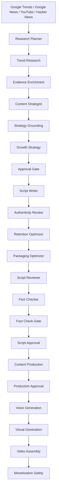

Historical documentation from uploaded ZIP. See root README for this release.

# Agentic Content Factory

A **local-first, multi-agent AI content production pipeline** for discovering real trends, creating evidence-grounded scripts, generating voice and visuals, assembling videos, and reviewing upload/monetization readiness.

The project is designed to run primarily on local hardware using **Ollama + Python + FFmpeg**, with separate pipelines for:

- real-trend YouTube content,
- cartoon/story content,
- local image/video experimentation.

> **Current development environment:** Apple Silicon M2, 8 GB unified memory, Python 3.13, Ollama, FFmpeg.

---

## Why This Project Exists

Most AI content pipelines stop at:

```text
prompt -> script -> image -> slideshow
```

This project aims for a more complete production workflow:

```text
trend discovery
    -> evidence collection
    -> strategy
    -> grounded script
    -> review + fact check
    -> production plan
    -> voice
    -> visuals
    -> video assembly
    -> packaging
    -> monetization/readiness review
```

The goal is not only to generate content, but to make the pipeline:

- evidence-aware,
- modular,
- locally runnable,
- reproducible,
- safer against hallucinated facts,
- less repetitive visually,
- suitable for iterative automation experiments.

---

# Core Architecture



---

# Main Capabilities

## 1. Real Trend Discovery

The AUTO pipeline can discover candidate topics from multiple public signals.

Current sources include:

- Google Trends
- Google News
- YouTube
- Hacker News

The research flow:

1. collects candidate topics,
2. filters weak/generic candidates,
3. validates freshness and relevance,
4. scores competition/opportunity,
5. selects the strongest topic,
6. enriches it with additional current evidence.

Example runtime output:

```text
[AUTO SOURCE] Google Trends: ...
[AUTO SOURCE] Google News: ...
[AUTO SOURCE] Hacker News: ...

[TREND] Ranking:
[TREND] #1 ...
[TREND] #2 ...
[TREND] Selected topic: ...
```

## 2. Multi-Language Market Discovery

AUTO mode supports language/market discovery across multiple regions.

Examples currently used by the pipeline include:

```text
IN:hi
US:en
ID:id
BR:pt
MX:es
JP:ja
PK:ur
FR:fr
BD:bn
SA:ar
```

The selected market/language can influence trend priority, content language, strategy, narration language and packaging.

## 3. Evidence-Grounded Strategy

The strategy layer is intentionally separated from raw trend discovery.

Agents can:

- determine the likely content angle,
- estimate a realistic duration,
- remove unsupported strategy terms,
- preserve the actual identity of the topic,
- avoid turning weak evidence into invented certainty.

Example:

```text
[GROUNDING] Strategy drift corrected.
[GROUNDING] Evidence-based duration: 8m -> 7m
```

## 4. Local LLM with Ollama

The primary local text model is currently:

```text
llama3.2
```

Ollama is used for content strategy, script writing, packaging ideas, review, structured reasoning and fact-check support.

The LLM is the **reasoning/writing layer**. It does **not** directly render the final MP4.

---

# Script Generation

The script writer is designed around several constraints:

- target-language continuity,
- evidence limits,
- realistic narration length,
- no invented facts,
- spoken-video style,
- conservative wording when evidence is weak.

The system also reconciles video duration with the actual narration length.

Example:

```text
[SCRIPT] Final narration length: 825 words
[SCRIPT] Duration reconciled: 8m -> 6m from actual narration length.
```

A ~300-word narration is therefore not silently presented as a 7-minute script.

## Bounded Script Generation

Long single-shot local LLM generation can be expensive on small hardware.

A chunked Script Writer design has been developed to move toward:

```text
target script
    |
    +--> chunk 1
    +--> chunk 2
    +--> chunk 3
    +--> chunk 4
    |
    -> merged YouTubeScript
```

The intended design uses bounded calls rather than letting one giant Ollama request occupy the workflow for many minutes.

This area is still under active validation.

---

# Authenticity, Retention and Packaging

After script generation, the text pipeline includes additional agents for:

### Authenticity Review

Checks whether the generated script looks overly generic or template-driven.

### Retention Optimization

Improves the opening/hook without rewriting the entire script unnecessarily.

### Packaging Optimization

Produces multiple title/thumbnail package candidates while rejecting unsupported angles.

Example:

```text
[PACKAGING] 3 A/B packages ready
```

---

# Fact Checking

A dedicated Fact Checker runs after script review.

Desired behavior:

```text
0 material issues
    -> PASS
    -> no repair

real issues
    -> repair once
    -> re-check
    -> PASS or BLOCK
```

This prevents a clean script from being unnecessarily rewritten and accidentally becoming less accurate.

Fact-check state handling and zero-issue behavior have been actively hardened during development.

---

# Content Production Planning

After script approval, the pipeline converts narration into a structured production plan.

The production plan can contain:

- voice segments,
- scene descriptions,
- visual types,
- subjects,
- key elements,
- composition,
- style,
- avoidance instructions,
- thumbnail prompt,
- YouTube description,
- tags.

The goal is to give downstream media agents explicit semantic instructions instead of vague prompts.

---

# Voice Generation

The project supports local voice generation using:

- **Piper**
- available macOS system voices

Voice generation produces individual audio segments before final video assembly.

Large `.onnx` voice model binaries are intentionally **not committed to Git** and must be downloaded/setup locally.

Useful helper scripts include:

```text
scripts/download_piper_voice.sh
scripts/setup_english_character_voices.sh
scripts/show_voices.sh
```

---

# Visual Generation

The current main content pipeline includes a local **Premium Visual Engine V4**.

Runtime output includes:

```text
[VISUAL] Premium Visual Engine V4 enabled.
[VIDEO] V4 quality output: 1080p30 / H.264 CRF17 / BT.709 / motion-aware.
```

The visual system includes modules for semantic routing, editorial composition, technical visuals, public-media handling, product composition, quality checks and domain-aware generation.

## Visual Diversity

One major development focus has been avoiding the classic AI slideshow problem:

```text
same layout
+ different image
+ repeated zoom
= repetitive video
```

Production planning can rotate editorial treatments such as:

- opening context,
- evidence board,
- timeline,
- comparison split,
- headline context,
- key points,
- what to watch,
- closing synthesis.

The goal is **material scene variation**, not only different prompts.

---

# Video Assembly

Final media assembly uses FFmpeg.

Current quality target:

```text
1080p
30 fps
H.264
CRF17
BT.709
```

The final video stage combines generated voice, scene visuals, motion, timing and final encoding.

---

# Monetization / Upload Readiness

The project contains a monetization-safety layer intended to detect risks such as:

- highly repetitive visual treatment,
- low originality,
- overly templated output,
- insufficient scene diversity,
- AI disclosure review requirements.

> This is an internal readiness heuristic, not a guarantee of YouTube monetization approval.

The pipeline should not mark content safe merely because it passed one technical check. Actual final video quality still needs review.

---

# Cartoon Pipeline

The repository also contains a separate cartoon/story pipeline.

Run with:

```bash
./run_cartoon.sh
```

Cartoon modules include concepts such as:

- characters,
- story planning,
- scene dynamics,
- performance direction,
- routing,
- capabilities,
- monetization checks,
- visual quality,
- action/world planning.

Relevant source area:

```text
src/content_factory/cartoon/
```

Relevant configuration includes:

```text
configs/cartoon_characters.json
configs/cartoon_backgrounds.json
configs/cartoon_capabilities.json
configs/cartoon_routes.json
configs/cartoon_visual_quality.json
configs/cartoon_monetization.json
```

### Cartoon Assets

Large sprite collections and generated character assets are intentionally excluded from Git to keep the repository lightweight.

They are runtime/local assets rather than source code.

---

# Local Video Experiment Pipeline

A separate local-video engine is also present for experimental media generation.

Run:

```bash
./run_own_video.sh
```

Source:

```text
src/content_factory/local_video/
```

Backends represented in the codebase include experiments around:

- Stable Video Diffusion,
- AnimateDiff,
- LTX-style motion integration,
- Piper voice,
- lip-sync integration.

This experimental pipeline is intentionally separate from the normal AUTO content path.

---

# Local Text-to-Video Experiment

A small local generative-video model was evaluated for the M2 8 GB environment:

```text
Wan2.1-T2V-1.3B
```

Test configuration included:

```text
MLX
4-bit quantization
416x240
17 frames
8 steps
no cache
```

The model download involved large components including an approximately 11 GB text encoder, and the process was eventually terminated by macOS memory pressure.

Conclusion:

> Full local text-to-video diffusion is currently not practical on the target 8 GB M2 machine.

For this hardware, the preferred strategy remains lighter scene-generation and motion techniques rather than forcing large video foundation models into unified memory.

---

# Hardware Philosophy

This project is intentionally developed around constrained local hardware.

Current machine:

```text
Apple Silicon M2
8 GB unified memory
```

That means architecture choices favor:

- bounded LLM calls,
- model unloading before media-heavy stages,
- local caching,
- small-batch generation,
- explicit memory release,
- deterministic fallbacks,
- separation of text and visual phases.

Heavy video foundation models should eventually be routed to a stronger self-hosted GPU worker if true generative-video inference becomes a requirement.

---

# Quick Start

## Prerequisites

Recommended for the currently tested local setup:

- macOS / Apple Silicon
- Python 3
- Ollama
- FFmpeg
- Git

Verify:

```bash
python3 --version
ollama --version
ffmpeg -version
```

## Clone

```bash
git clone https://github.com/raushan-raj-ai-engineer/agentic-content-factory.git
cd agentic-content-factory
```

## Python Environment

```bash
python3 -m venv .venv
source .venv/bin/activate
python -m pip install --upgrade pip
pip install -e .
```

---

# Configuration

Primary local configuration:

```text
configs/local.yaml
```

Local model selection can also be controlled through environment configuration.

Current local model:

```text
OLLAMA_MODEL=llama3.2
```

The project is designed so project configuration supplies the default model while environment overrides can be used for one-off experiments.

---

# Run Modes

## AUTO Real Trends

```bash
./run_auto.sh
```

This is the main end-to-end real-trend workflow.

Artifacts are created under:

```text
artifacts/<topic>/<run-id>/
```

Logs are written under:

```text
logs/
```

Both are intentionally ignored by Git.

## Cartoon

```bash
./run_cartoon.sh
```

## Own / Experimental Local Video

```bash
./run_own_video.sh
```

---

# Useful Helper Commands

```bash
./scripts/check_visual_engine.sh
./scripts/check_visual_provider_integrity.sh
./scripts/show_performance_report.sh
./scripts/show_monetization_report.sh
./scripts/show_growth_report.sh
./scripts/show_voices.sh
./scripts/clear_logs.sh
```

---

# Repository Structure

```text
agentic-content-factory/
├── configs/
├── docs/
│   └── DEVELOPMENT_NOTES.md
├── scripts/
├── src/content_factory/
│   ├── agents/
│   ├── cartoon/
│   ├── config/
│   ├── human/
│   ├── llm/
│   ├── local_video/
│   ├── monetization/
│   ├── orchestration/
│   ├── performance/
│   ├── research/
│   ├── thumbnail/
│   ├── utils/
│   ├── video/
│   ├── visual/
│   └── voice/
├── tests/
├── pyproject.toml
├── run_auto.sh
├── run_cartoon.sh
└── run_own_video.sh
```

---

# Files Intentionally Not Stored in Git

To keep the repository small and reproducible, large machine-specific/runtime files are ignored.

Examples:

```text
.venv/
.visual-venv/
.local-video-engine/
artifacts/
logs/
.repair-backups/
models/piper/*.onnx
large ML checkpoints
generated cartoon sprites
```

These files should be downloaded, generated, or recreated locally.

---

# Development Principles

## Evidence Before Length

Never stretch a script by inventing statistics, dates, quotes, motives, company responses, causal claims or unsupported event details.

## Real Duration

Narration length should determine realistic video duration.

## No Silent Fake AI-Video Fallback

If a true generative-video backend is requested but unavailable, a pan/zoom slideshow should not silently be labeled as full generative video.

## Preserve Working Components

Prefer small, surgical changes instead of replacing complete agents without need.

## Transactional Patching

Project repair scripts should ideally:

1. inspect current source,
2. transform in memory,
3. validate syntax,
4. compile,
5. back up,
6. commit only after validation,
7. restore on failure,
8. remain idempotent.

---

# Current Development Status

| Area | Status |
|---|---|
| Real trend discovery | ✅ Working |
| Evidence enrichment | ✅ Working |
| Multi-language market selection | ✅ Working |
| Strategy grounding | ✅ Working |
| Growth strategy | ✅ Working |
| Ollama / llama3.2 | ✅ Working |
| Script generation | 🟡 Active reliability improvements |
| Authenticity / retention | ✅ Integrated |
| Packaging optimizer | ✅ Integrated |
| Fact checker | 🟡 Hardened; continuing end-to-end validation |
| Production planning | ✅ Integrated |
| Piper/macOS voice | ✅ Integrated |
| Visual Engine V4 | ✅ Integrated |
| FFmpeg video assembly | ✅ Integrated |
| Monetization safety | 🟡 Active validation |
| Cartoon pipeline | 🟡 Experimental / evolving |
| Local video engine | 🟡 Experimental |
| Full T2V on M2 8 GB | ❌ Not practical with tested Wan2.1 setup |

---

# Roadmap

- [ ] complete end-to-end validation of bounded/chunked script generation,
- [ ] confirm zero-issue Fact Checker PASS behavior across full runs,
- [ ] validate monetization diversity through final video output,
- [ ] improve visual variation without creating slideshow-style content,
- [ ] improve scene/story semantic matching,
- [ ] evaluate lightweight character/talking animation,
- [ ] evaluate frame interpolation for smoother local motion,
- [ ] make large local asset setup reproducible,
- [ ] add more automated integration tests,
- [ ] optionally support a remote/self-hosted GPU worker for heavy video models.

---

# Development Notes

Detailed implementation history, experiments, known issues and architecture decisions are documented in:

```text
docs/DEVELOPMENT_NOTES.md
```

---

# Disclaimer

This repository is an experimental AI automation project.

Generated content should be reviewed before publication for:

- factual accuracy,
- copyright/licensing,
- visual quality,
- platform policies,
- synthetic-media disclosure requirements,
- monetization eligibility.

Passing an internal quality or monetization check does not guarantee approval by any external platform.

---

# Repository

https://github.com/raushan-raj-ai-engineer/agentic-content-factory

---

## Author

Built as a hands-on exploration of:

- agentic AI,
- local LLM orchestration,
- automated research,
- AI-assisted content production,
- multimodal media pipelines,
- quality gates,
- automation reliability.
